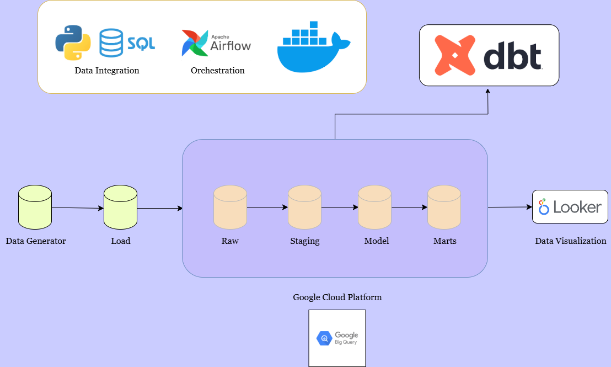
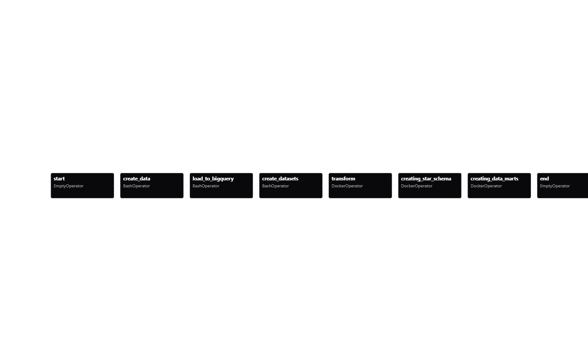
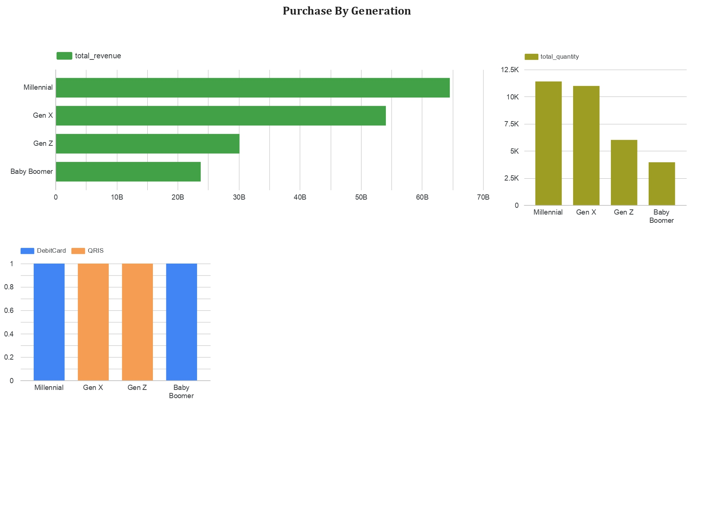
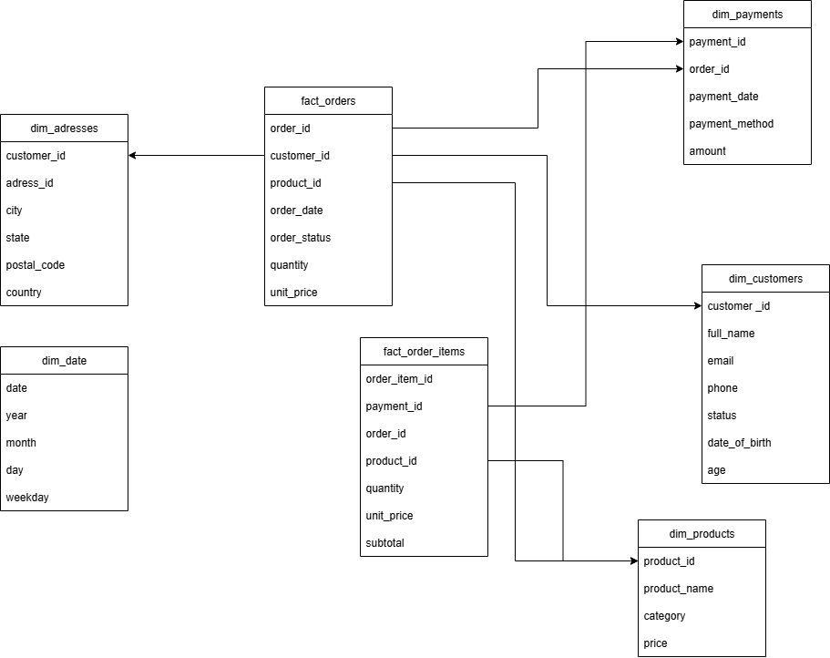

# Final Project

## Introduction

This project building a data engineering pipeline from extract, load, and transform (ELT). The pipeline is designed to handle data to bigquery 

Tools

- DBT
- Google Cloud Services
- Airflow
- Data Modelling
- Data Governance

## Architecture

- Docker: Container to run Airflow and DBT
- Airflow: Orchestration and scheduling data pipeline
- Google Cloud Platform (BigQuery): Storage for data and layering all data
- Looker Studio: Data visualization in dashboard

## DAG

- Start: An empty task used as the starting point of the pipeline, also for sending alerts if needed.
- Data_Generator: generate data
- Load_to_Bigquery: Loads the raw data into the raw dataset in BigQuery.
- Create_Datasets: Creates the staging, model, and marts datasets in BigQuery.
- Transform: Transforms data from the raw dataset into the staging dataset.
- Creating_Star_Schema: Builds star schema tables 
- Creating_Data_Marts: Creates analytical tables (data marts) for business use cases
- End: An empty task marking the end of the pipeline, also for sending alerts if needed.

## Dashboard

- Purchase by generation
- Total Revenue every generation
- total quantity every generation
- top payment method in every generation

## ER Diagram

